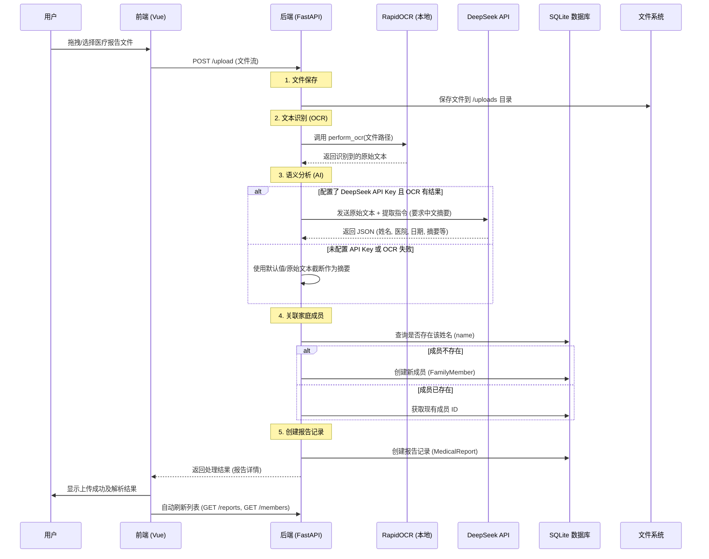
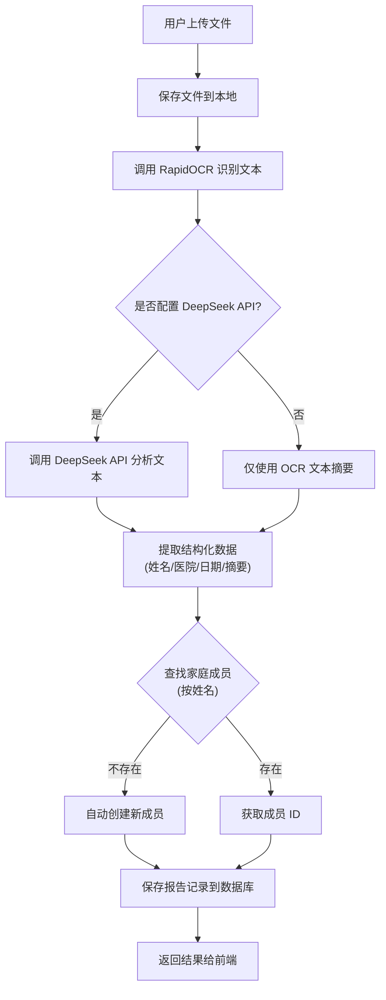
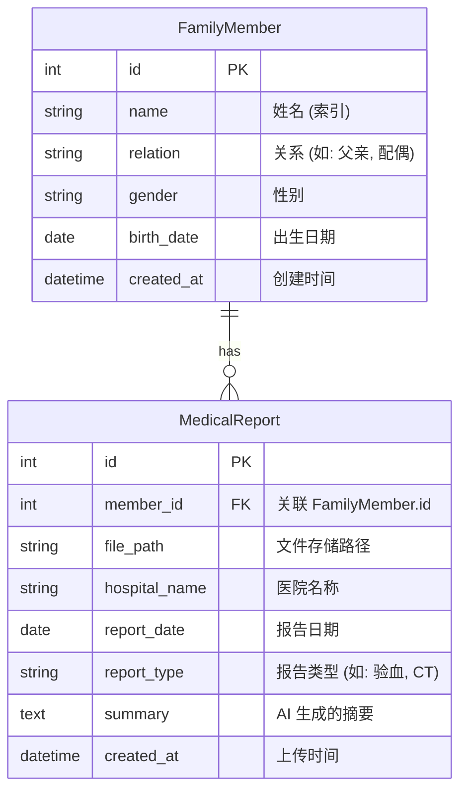

# 家庭健康档案管理系统设计文档

本文档描述了家庭健康档案管理系统（Family Health Manager）的整体架构、核心业务流程及数据设计。

## 1. 系统概述

本系统旨在帮助用户数字化管理家庭成员的医疗报告。通过集成 OCR（光学字符识别）和 LLM（大语言模型）技术，系统能够自动从图片或 PDF 格式的医疗报告中提取关键信息（如患者姓名、医院、诊断摘要等），并自动归档到对应的家庭成员名下。

## 2. 系统架构

系统采用前后端分离架构：

*   **前端**: Vue 3 + Element Plus，负责用户交互、文件上传和数据展示。
*   **后端**: FastAPI (Python)，负责业务逻辑、API 接口、文件处理。
*   **AI/OCR 服务**:
    *   **RapidOCR**: 本地运行，用于从图像/PDF 中提取原始文本。
    *   **DeepSeek API**: 云端大模型，用于语义分析和结构化信息提取。
*   **数据库**: SQLite，存储家庭成员和报告的元数据。
*   **文件存储**: 本地文件系统，存储上传的原始报告文件。

## 3. 核心业务流程

### 3.1 医疗报告上传与智能化处理流程

这是系统的核心功能。当用户上传一份医疗报告时，后端会自动执行一系列处理步骤，实现“上传即归档”。

### 3.2 流程图视图

## 4. 数据模型设计

系统主要包含两个核心实体：`FamilyMember`（家庭成员）和 `MedicalReport`（医疗报告），它们之间是一对多的关系。

## 5. 接口设计摘要

| 方法 | 路径 | 描述 | 主要参数 |
| :--- | :--- | :--- | :--- |
| `POST` | `/upload` | 上传并分析报告 | `file`: Binary |
| `GET` | `/members` | 获取成员列表 | `skip`, `limit` |
| `GET` | `/reports` | 获取报告列表 | `skip`, `limit` |
| `GET` | `/` | 健康检查 | - |

## 6. 技术栈细节

*   **FastAPI**: 提供高性能的异步 Web 服务。
*   **SQLAlchemy**: ORM 框架，用于数据库操作。
*   **RapidOCR**: 基于 ONNXRuntime 的轻量级 OCR 引擎，无需联网即可运行。
*   **DeepSeek V3 (Chat)**: 通过 Prompt Engineering 指导模型输出严格的 JSON 格式，便于程序解析。
